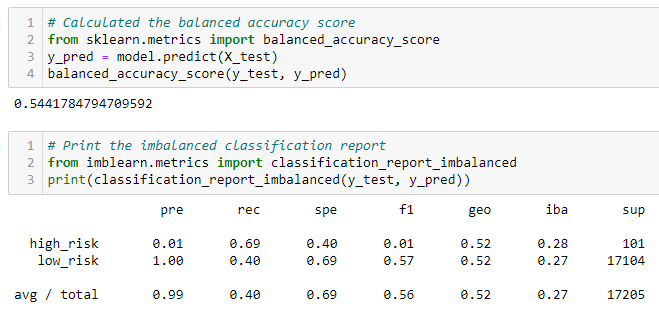

## Overview
Overview of the analysis: Explain the purpose of this analysis.

## Results
Results: Using bulleted lists, describe the balanced accuracy scores and the precision and recall scores of all six machine learning models. Use screenshots of your outputs to support your results.

### Random Oversampler
- **Accuracy**: 65.73%
- **Precision & Recall**: 

### SMOTE Oversampling
- **Accuracy**: 
- **Precision & Recall**: 

### Cluster Centroids
- **Accuracy**: 
- **Precision & Recall**: 

### Combination Sampling
- **Accuracy**: 
- **Precision & Recall**: 

### Balanced Random Forest Classifier
- **Accuracy**: 
- **Precision & Recall**: 

### Easy Ensemble AdaBoost
- **Accuracy**: 
- **Precision & Recall**: 

## Summary
Summary: Summarize the results of the machine learning models, and include a recommendation on the model to use, if any. If you do not recommend any of the models, justify your reasoning.
