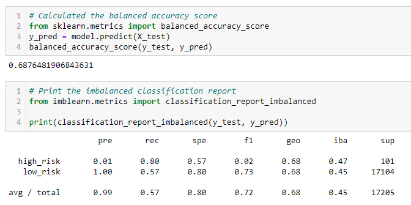

## Overview
Using unsupervised machine learning, Jupyter Notebook, and SciKit Learn, determine if a model exists to best predict **High** or **Low** risk loan applications based on ~80 different features.

## Results
### Random Oversampler
- **Accuracy**: 0.6573
- **Precision & Recall - High Risk**: Low precision and mid-high recall indicate a high number of false positives.
- **Precision & Recall - Low Risk**: Perfect precision and somewhat-low recall indicate a number of false negatives.

### SMOTE Oversampling
- **Accuracy**: 0.6622
- **Precision & Recall - High Risk**:  The low F1 score indicates an imbalance between recall and precision similar to that of the previous model.
- **Precision & Recall - Low Risk**: Perfect precision and somewhat-better recall than the random oversampling indicates this model is slightly better at predicting true negatives.

### Cluster Centroids
- **Accuracy**: 0.5441
- **Precision & Recall - High Risk**:  A low F1 and precision score indicate an overlarge number of false positives.
- **Precision & Recall - Low Risk**: Again, perfect precision and somewhat-low recall indicate some false negatives.

### Combination Sampling
- **Accuracy**: 0.6876
- **Precision & Recall - High Risk**:  Low precision and high recall indicate this model is very sensitive, but with a high number of false positives.
- **Precision & Recall - Low Risk**: High precision and middling recall indicate this model is better than the cluster centroids model at predicting true negatives.

### Balanced Random Forest Classifier
- **Accuracy**: 0.7887
- **Precision & Recall - High Risk**:  Low precision and F1 score indicate that we’re still seeing a large number of false posittives, however, not as large as some of the other models. 
- **Precision & Recall - Low Risk**: A decently high precision and F1 score indicate this model is the best we’ve yet seen at predicting tue negatives.

### Easy Ensemble AdaBoost
- **Accuracy**: 0.9316
- **Precision & Recall - High Risk**:  Low precision and high recal still result in a low F1 score, but this model resulted in the fewest number of false positives.
- **Precision & Recall - Low Risk** Prefect precision and nearly-perfect recall shows this model as the best choice of all.

## Summary
Of all six machine-leaning models, the two ensemble models clearly outperformed the four oversampling and undersampling models. 

Based on the accuracy score (0.9316) and the confusion matrix results of the Easy Ensemble AdaBoost Classifier, this model has my recommendation for use. With smaller false positive and negative results than any other model, this model has the most potential. 
